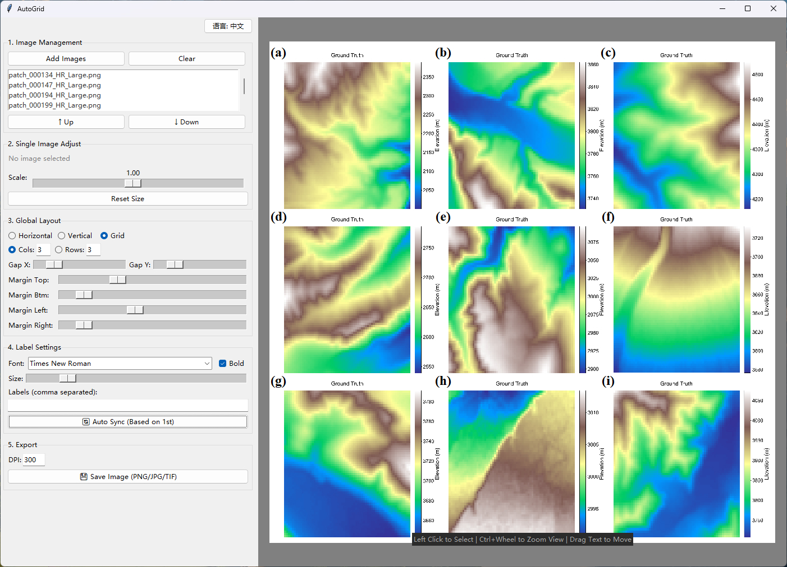

# AutoGrid - Scientific Image Composition Tool

> **Stop aligning figures manually in PowerPoint!**  
> **彻底告别在 PPT 中手动对齐图片的痛苦时光！**

*(Screenshot: Automatic layout with smart label synchronization)*

---

## 🇬🇧 English Version

### 📖 Introduction

**AutoGrid** is a lightweight Windows tool designed specifically for researchers and students (CV, Remote Sensing, Medical Imaging, etc.). It automates the process of creating multi-image figures for academic papers. Unlike PowerPoint or Photoshop, it ensures perfect alignment, uniform spacing, and consistent labeling with just a few clicks.

### ✨ Key Features

1.  **🚀 Automatic Layout**
    *   **Grid System:** Automatically arranges imported images in a customizable grid (Rows/Columns).
    *   **Custom Spacing:** Precisely control X-axis and Y-axis gaps using sliders.
    *   **Margins:** Easily adjust the outer white margins of the entire figure.

2.  **🧠 Smart Label Synchronization (Highlight!)**
    *   **Anchor-based Sync:** Drag the first label `(a)` to your desired position on the first image.
    *   **One-Click Align:** Click the **"Suto Sync"** button, and labels `(b)`, `(c)`, `(d)`... will automatically move to the **exact same relative position** on their respective images.
    *   **No more manual alignment needed!**

3.  **🔤 Professional Annotation**
    *   **Academic Fonts:** Built-in support for standard fonts like **Arial** and **Times New Roman** and **Calibri** and **SimHei**.
    *   **Rich Styling:** Adjustable font size, bold toggle, and customizable label format.

4.  **🖼️ Image Handling**
    *   **Format Support:** Supports PNG, JPG, TIFF, and BMP.
    *   **Individual Scaling:** Select a specific image to scale it individually (perfect for mixing images of different aspect ratios).
    *   **Reordering:** Easy list-based reordering (Move Up/Down).

5.  **📤 High-Quality Export**
    *   **Custom DPI:** Define your output DPI (e.g., 300, 600) to meet strict journal requirements.
    *   **Formats:** Export the final combined figure as PNG, JPG, or TIFF.

### 🛠️ How to Use

1.  **Import:** Click `Add Images` to load your source files.
2.  **Layout:** Choose `Grid` mode, set the number of columns (e.g., Fixed Columns: 2). Adjust `X-Dist` and `Y-Dist` for spacing.
3.  **Labeling:**
    *   Drag label `(a)` on the preview canvas to the perfect spot.
    *   Click the **`Smart Sync`** button to align the rest.
4.  **Export:** Set your desired DPI (e.g., 300) and click `Save Image`.

### 📥 Download

*   **Portable:** No installation required, just unzip and run.
*   **Platform:** Windows 10/11.

### ☕ Support

If **AutoGrid** saved your time on your paper, please give me a **Star** ⭐!

### 📄 License

MIT License © 2024 [Your Name/GitHub Username]

---
---

## 🇨🇳 中文说明

### 📖 简介

**AutoGrid** 是一款专为科研人员和学生（计算机视觉/遥感/医学影像等方向）设计的轻量级 Windows 工具。它能自动完成学术论文中多图组合的排版工作。与 PowerPoint 或 Photoshop 不同，它只需几次点击，即可保证图片完美对齐、间距均匀以及标签风格统一。

### ✨ 核心功能

1.  **🚀 自动网格排版**
    *   **网格系统：** 自动将导入的图片按行列网格排列，支持自定义行列数。
    *   **自定义间距：** 通过滑块精确控制横向 (X距) 和纵向 (Y距) 的间距。
    *   **留白控制：** 轻松调整整个组图的外边距（留白）。

2.  **🧠 智能标签同步 (核心亮点！)**
    *   **锚点同步：** 只需要将第一个图片的序号 `(a)` 拖动到你满意的相对位置。
    *   **一键对齐：** 点击 **“智能同步”** 按钮，后续所有图片的序号 `(b)`, `(c)`... 会自动跳转到**完全一致的相对位置**。
    *   **从此不再需要用肉眼逐个对齐序号！**

3.  **🔤 专业标注设置**
    *   **学术字体：** 内置支持 **Arial** 、 **Times New Roman** 、 **Calibri** 以及 **SimHei** 等论文常用字体。
    *   **丰富样式：** 支持调节字号、加粗，以及自定义序号生成格式。

4.  **🖼️ 图片处理**
    *   **多格式支持：** 支持 PNG, JPG, TIFF, BMP 等常见格式。
    *   **单独缩放：** 选中特定图片可单独调整缩放比例（完美解决素材尺寸不一的问题）。
    *   **排序调整：** 列表式管理，轻松上移或下移调整图片顺序。

5.  **📤 高清导出**
    *   **自定义 DPI：** 可设置 300 或 600 DPI，满足期刊投稿对清晰度的严格要求。
    *   **格式选择：** 导出为 PNG, JPG 或 TIFF 格式。

### 🛠️ 使用指南

1.  **导入：** 点击 `添加图片` 按钮导入素材文件。
2.  **布局：** 选择 `网格` 模式，设置列数（例如定列：2）。调整 XY 间距和留白。
3.  **标注：**
    *   在右侧预览区，鼠标拖拽 `(a)` 到你想要的位置。
    *   点击 **`智能同步`** 按钮，其余序号自动对齐。
4.  **导出：** 设置 DPI（如 300），点击 `保存图片`。

### 📥 下载

*   **绿色版：** 无需安装，解压即用。
*   **平台：** Windows 10/11。

### ☕ 支持

如果 **AutoGrid** 帮你节省了写论文的时间，请给我点一个 **Star** ⭐！

### 📄 许可证

MIT License © 2024 [Your Name/GitHub Username]
